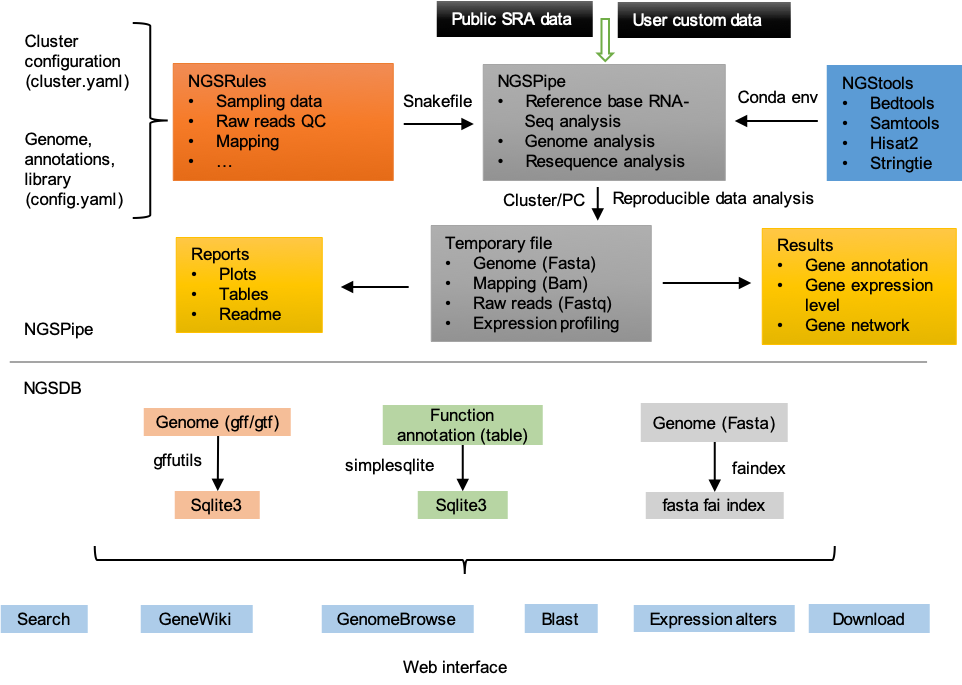

# NGSPipeDb - NGS pipeline and database

*__Author:__ Dr. Xuan Zhang* <sup>[](https://github.com/xuanblo)</sup> <sup>[](https://scholar.google.com/citations?user=omUk0vUAAAAJ)</sup>
*__Last update:__ 2020-12-19*
*__Citation:__ NGSPipeDb: An automated pipeline for parallel processing of huge NGS data and database generation. 2020. bioinformatics.*

__Table of Contents:__

1. [Introduction to NGSPipeDb](#Intro)
2. [System requirements](#Require)
3. [Anatomy of a NGSPipeDb project](#Anatomy)
4. [Quick Start (5+6+7) - One time installation of components necessary and run test for typical application scenarios](#QuickStarted)
5. [Step-by-Step RNA-seq analysis](#Step-by-Step-RNASeq)
    1. [Installing wget and git](#BasicLinux)
    2. [Installing Miniconda3](#Miniconda)
    3. [Installing the NGSPipeDb conda environments](#NGSPipeDbEnv)
    4. [Downloading the NGSPipeDb source code](#NGSPipeDbSource)  
    5. [Downloading the NGSPipeDb test files](#Testdata)  
    6. [Run test data](#RunTest)
    7. [Run your custome data](#RunRawdata)
6. [Generate report](#Report)
7. [Step-by-Step database generate](#Step-by-Step-Database)
    1. [Installing requirement](#DatabaseRequirement)
    2. [Convert table file to sqlite3](#Table2Sqlite3)
    3. [Database config](#DatabaseConfig)
    4. [Start server](#RunServer)
8. [Reproducibility](#Reproducibility)
9. [Troubleshooting](#Troubleshooting)

## Introduction to NGSPipeDb <a name="Intro"></a>

__NGSPipeDb__ is an automated pipeline for parallel processing of huge next generation sequencing (NGS) data and database generation using [snakemake workflow](https://snakemake.readthedocs.io/en/stable/index.html) which allows for ease of use, optimal speed, and a highly modular code that can be further added onto and customized by experienced users. It can be further divided into `NGSPipe` and `NGSDb` for individual usage. 

__NGSPipe__ consists of a [Snakefile](https://snakemake.readthedocs.io/en/stable/snakefiles/rules.html) (`ngspipe/rnaseq.snakefile.py`, it includes some basic rules `ngspipe/rule/*.snakefile.py`), [conda](https://conda.io/docs/) environment files (`ngspipe/envs/*.yaml`), a configuration file (`ngspipe/config/rnaseq.config.yaml`), a set of [python](#), [R](#), [Shell](#) and [Perl](#) scripts (`ngspipe/scripts/*.py`), and a set of [reStructuretext](#) reports (`reports/*.rst`). It combines the use of several dozen omic-seq tools, suites, and packages to create a complete pipeline that takes [RNA-seq analysis](), [resequcing analysis]() etc. from raw sequencing data all the way through alignment, quality control, unsupervised analyses, differential expression, and downstream pathway analysis. It is implemented such that alternative or similar analysis can be added or removed. The results are compiled in a simple and highly visual [report](ngspipe/metadata/report.html) containing the key figures to explain the analysis, and then compiles all of the relevant files, tables, and pictures into an easy to navigate folder. Table file such as csv, tsv, xlsx etc. 

In addition, __NGSDb__ has been outfitted with several recently published tools that allow for visualize and data share.can be convert to [Sqlite3](#) format. The [Django](#) project and apps can be orgined by user defined. It is easy to share your data with a web inteface. a set of `apps` (such as `home`, `igv`, `geneExpAtlas`, `efp brwose`).

By default, the __NGSPipeDb__ performs all the steps shown in the [diagram](img/report_2019_03_14_salmonAlignment_visualization.png) below. However, advanced user, you can easily modify the `Snakefile` and the `config.yaml` and/or add "custom rules" to enable additional functions.



Currently, transcript quantification with `Salmon` at the read-level or gene quantification by [`featureCounts`](http://subread.sourceforge.net) can be activated.
The first version handles [RNA-Seq](#) workflow.

* (1) Tophat - Cufflink - Cuffdiff; 
* (2) Subread - featureCounts - DESeq2; 
* (3) STAR - RSEM - EBSeq; 
* (4) Bowtie - eXpress - edgeR; 
* (5) kallisto - sleuth; 
* (6) HISAT - StringTie - Ballgown.

__TODO__:

- NGSPipe
    1. ChIP-seq*
- NGSdb
    1. efp

## System requirements <a name="Require"></a>

Building NGSPipeDb and running the examples require Linux, MacOS or Windows Subsystem for Linux ([WSL](https://wiki.ubuntu.com/WSL)) on Win10. Other Unix environments will probably work but have not been tested.

Some of the tools that NGSPipeDb uses, e.g. STAR and cufflinks are very memory intensive programs. Therefore we recommend the following system requirements for NGSPipeDb:

We recommend that you run NGSPipeDb on a server that has at least 30GB of ram. This will allow for a single-threaded NGSPipeDb run (on mouse samples).

We recommend that you have at least 128GB of ram and at least a 4-core CPU if you want to run NGSPipeDb in multi-threaded mode (which will speedup the workflow significantly). Our own servers have 256GB of ram and 32 cores.

## Anatomy of a NGSPipeDb project <a name="Anatomy"></a>

It is recommended to download NGSPipeDb source and change its name to your project name (For example: `mv NGSPipeDb mouse_transcriptome_analysis`), it may looks like the following structure (command: `tree -d -L 2 mouse_transcriptome_analysis`):

```shell
mouse_transcriptome_analysis
├── README.md
├── ngsdb
│   ├── blastplus
│   ├── db.sqlite3
│   ├── geneAnno
│   ├── geneExpAtlas
│   ├── home
│   ├── igv
│   ├── manage.py
│   └── ngsdb
├── ngspipe
│   ├── config
│   ├── db_generate.Snakefile.py
│   ├── envs
│   ├── imgs
│   ├── metadata
│   ├── notebooks
│   ├── reports
│   ├── rnaseq_analysis.Snakefile.py
│   ├── rules
│   └── scripts
├── results
│   ├── report
│   ├── resultdata
│   └── sqlite3
└── testdata
```

The workflow code goes into a subfolder `ngspipe`, while the configuration is stored in a subfolder `config`. Inside of the workflow subfolder, the central Snakefile marks the entrypoint of the workflow. In addition to the central Snakefile, rules are stored in a modular way, using the optional subfolder `ngspipe/rules`. Further, scripts are stored in a subfolder `workflow/scripts` and notebooks in a subfolder `workflow/notebooks`. Conda environments are stored in a subfolder `workflow/envs`. Finally, report caption files are stored in `workflow/report`. 

The database code goes into a subfolder `ngsdb`, while the `manage.py` is ngsdb's command-line utility for administrative tasks. A golabl setting file is stored under `ngsdb/ngsdb`, such as `ngsdb/ngsdb/setting.py` and `ngsdb/ngsdb/urls.py`. Many ngsdb function module take a app name. For example, if your INSTALLED_APPS in `ngsdb/ngsdb/setting.py` contains the string 'igv', the database will contain a page of IGV genome browser.

All output files generated in the workflow should be stored under `results/result`, unless they are rather retrieved report, in which case they should be stored under `results/report`. The latter subfolder `results/sqlite3` contains Sqlite3 kind file that shall be used by ngsdb.

## Quick Start - One time installation of components necessary for an individual user <a name="QuickStarted"></a>

Three commands to start analysing test data:
```shell
# download ngspipedb to anywhere you want
git clone https://github.com/xuanblo/NGSPipeDb.git && mv NGSPipeDb mouse_transcriptome_analysis && cd mouse_transcriptome_analysis
# download test data and create environment
bash ngspipe/scripts/one_step_runtest.sh
```

Now you can viste your website on http://127.0.0.1:8000. All result are stored in `results`.
- Example of report <sub>[](http://www.liu-lab.com)</sub>.
- Example of database <sub>[](http://www.liu-lab.com)</sub>.


If you have more time, then we recommend you configure ngspipedb according to your needs. For more details, please see [step by step](#step-by-step) bellow.

## Step-by-step - slow steps for user custom need <a href="Step-by-Step-RNASeq"></a>

__If you are looking to install for a system of users, we recommend you look at appendix C below. Note that this can also be a very useful step for individual users as well!__

Although included in this README are step-by-step instructions, it is assumed that the user has a basic understanding of the [nix command line interface](https://en.wikipedia.org/wiki/Command-line_interface).

### 1. Installing wget and git <a name="BasicLinux"></a>

To get some of the required software packages, we will use the command line tools called [wget](http://www.gnu.org/software/wget/) and [git](https://git-scm.com/book/en/v2/Getting-Started-Installing-Git).  *wget* is a popular tool for downloading things off of the internet.  *git* is a distributed version control system which we will use to checkout the NGSPipeDb code.

__These tools are already pre-installed in most systems__, but if you are unsure whether or not you have *wget* enter `wget` and if the return is `wget: command not found`, then you will have to install *wget*.  Do likewise for *git*.

### 2. Installing Miniconda3 <a name="Miniconda"></a>

Snakepipes uses conda for installation and dependency resolution, so you will need to `install conda <https://conda.io/docs/user-guide/install/index.html>`__ first.

We will be using the [Miniconda3](http://conda.pydata.org/miniconda.html) package management system (aka __CONDA__) to manage all of the software packages that __NGSPipeDb__ is dependent on. 

Use following commands to retrieve and then __RUN__ the Minicoda3 installation script:  
1. `wget https://repo.continuum.io/miniconda/Miniconda3-latest-Linux-x86_64.sh`  
2. `bash Miniconda3-latest-Linux-x86_64.sh`  
    - Whilst running the installation script, follow the commands listed on screen, and press the _enter_ key to scroll.
    - __Make sure to answer yes when asked if you want to prepend Miniconda3 to PATH.__
    - Close your terminal, open a new one and you should now have Conda working! or run `source ~/.bashrc`. Test by entering:  
        `conda update conda`
        - Press `y` to confirm the conda updates
3. install [mamba](#) to make install software faster. `conda install mamba -c conda-forge`
    
__NOTE__: you will only have to install Minicoda3 once.  
__NOTE__: remember to close your terminal session and re-login

### 3. Installing the NGSPipeDb conda environments <a name="NGSPipeDbEnv"></a>

We are now ready to use __CONDA__ to install the software packages which __NGSPipeDb__ is dependent on. Simply run the following:

1. `conda create -n ngspipedb python=3.8`
    This will create a new conda environment called "snakePipes" into which snakePipes is installed. You will then need to create the conda environments needed by the various workflows. To facilitate this we provide the `ngspipedb` commands:

2. `conda activate ngspipedb` to activate the appropriate conda environment.

3. `mamba env update -n ngspipedb --file ngspipe/envs/requirement.yaml --prune` to update some bioinformatics tools we will use bellow.


__NOTE__: you will only have to install the NGSPipeDb conda environments once. For more information about how to `install conda env local`, `share conda env` can see bellow.

### 4. Downloading the NGSPipeDb source code <a name="NGSPipeDbSource"></a>

Within your __PROJECT__ directory, issue the following commands:  
1. `wget http://www.liu-lab.com/pub/NGSPipeDb_v1.0.tar.gz`  
2. `tar -xf NGSPipeDb_v1.0.tar.gz`  
3. `mv NGSPipeDb_v1.0 mouse_transcriptome_analysis`  
__NOTE__: the XXXXX refers to the latest changeset of NGSPipeDb, so it will differ  

__ADVANCED__: you may clone the latest version of [__NGSPipeDb__](https://www.github.com/xuanblo/NGSPipeDb) using git: `git clone https://www.github.com/xuanblo/NGSPipeDb`


### 5. DOWNLOADING the NGSPipeDb test files <a name="Testdata"></a>

__ngspipedb__ is dependent on reference files which can be found for the supported species listed below:  [download link](https://www.dropbox.com/sh/8cqooj05i7rnyou/AAB-i4hHxQwqJDTXbzM_2JPua?dl=0)

1. run `bash ngspipe/scripts/download_testdata.sh testdata` to download test data to `./testdata`:

2. run `python ngspipe/scripts/generate_replicat.py` to generate replicate data (Optional):

3. create samples.xls, for example, if you have two samples named "control" and "treated", just create a text file (maybe named sample.xls) with one column and two rows.

resources/testdata/sample.info.xls:
```
control
treated
```

__BEST PRACTICE:__ we recommend that you download the reference files that you need and then untarring then in a directory called "VIPER_static".  So for example, suppose you make "resources/testdata" in you home directory then you would have the following directory structure:
```
resources/testdata/
├── GRCm38.83.chr19.gtf
├── RunMe.sh
├── chr19.fa
├── chr19.fa_wget.log
├── control_R1.fq.gz
├── control_R2.fq.gz
├── generate_replicat.py
├── samples.xls
├── treated_R1.fq.gz
└── treated_R2.fq.gz

0 directories, 10 files
```

__NOTE__: you will only have to download the static references once.

### 6. run test data <a name="RunTest"></a>

We provied a simple workflow for you to take a glance of NGSPipedb. In NGSPipe part, it contains 7 step analysis:

```python
1. sampling data
2. raw reads qc
3. junction alignmnet
4. transcript assembly
5. quantification
6. statistic
```

Please see the dag plot by command `snakemake -s ngspipe/RNA-Seq.Snakefile.py --dag|`


You can simply run `snakemake -s ngspipe/RNA-Seq.Snakefile.py -p -j1` and all the result are stored in `resutls` folder.

```tree
```

__Note__: /Users/zhangxuan/opt/anaconda3/envs/ngspipedb_py38_conda_env/lib/python3.8/site-packages/snakemake/report/report.html.jinja2
url: https://raw.githubusercontent.com/eligrey/FileSaver.js/2.0.0/src/FileSaver.js is blocked in China. Please change it to https://cdnjs.cloudflare.com/ajax/libs/FileSaver.js/2.0.0/FileSaver.js

the configfile was writed in `ngspipe/envs/rna-seq.yaml`:
```python
config: "envs/rna-seq.yaml"
```

### 7. run your custome data <a name="RunRawdata"></a>
edit file `NGSPipeCode/config.yaml` for general data path or something. edit file `snakefile` for general data path or something.
Configuring the META files: config.yaml <a name="config"></a>
The config.yaml file has three main sections. __PATHS__, __PARAMS__, __SAMPLES__:

edit file `NGSPipeCode/Snakefile` for advance setting, such as sampling method, mapping tool, email address to receive run log.

__*1. Perepare your sample*__:

Raw data files can either be fastq, fastq.gz, or bam formated files. If your raw data are located in __somewhere else__, you can copy them to `rawdata`, or create soft links like `cd rawdata && ln -s yoursamplepath/*.fq.gz ./`.

As recommended above, if all of your raw data are located in __rawdata__, then create a `samples.xls` file like:

```
lung.rep1
lung.rep2
lung.rep3
liver.rep1
liver.rep2
liver.rep3
```

__If you did not follow the recommended best practice__ then you will have to specify the full paths here.

Each sample should be given a __NAME__ (arbitrary text) and a __PATH__


__IMPORTANT__: __You cannot mix Paired-end and Single-end samples within the same VIPER run as this will cause an ERROR__. If necessary, run all of one type of data first, followed by the net type of data after.

__*2. Copying over the META files:*__

The __META__ files (*config.yaml* and *metasheet.csv*) allow you to configure each run.  They are explained in much more detail below.  For now, we simply copy them from the viper source directory:
```
    cd PROJECT
    cp viper/config.yaml .
    cp viper/metasheet.csv .
```
__We will explain how to edit and configure these files shortly below__


In this section, you will need to specify the location of the following static reference files.

__The script path is always relative to the Snakefile containing the directive (in contrast to the input and output file paths, which are relative to the working directory).__

All paths in the snakefile are interpreted relative to the directory snakemake is executed in. 

__*3. custom your snakefile*__

__*4. run*__

```shell
# dry run, use -n parameter only print task plan, -p print commands
snakemake -np --snakefile NGSPipeCode/Snakefile --configfile NGSPipeCode/config.yaml

# run pipe
snakemake -p --snakefile NGSPipeCode/Snakefile --configfile NGSPipeCode/config.yaml -j1


```
input和output，log都是相对于你的执行目录
其他的如env，include的路径都是相对于snakefile的路径

## 7. rgenerate report <a name="Report"></a>

```shell
# generate report 
# need run step 7 first
snakemake --snakefile NGSPipeCode/Snakefile --configfile NGSPipeCode/config.yaml --report NGSPipeOut/Report/20201102-StringtieMaxIntron1000/report.html
```

__Note__: run snakemake under directory `NGSPipeDB`
__Note__: if you get connected error in this step, you can solve this problem by edit file `ngspipedb_py38_conda_env/lib/python3.8/site-packages/snakemake/report/report.html.jinja2` to change `https://raw.githubusercontent.com/eligrey/FileSaver.js/2.0.0/src/FileSaver.js` to `https://cdnjs.cloudflare.com/ajax/libs/FileSaver.js/2.0.0/FileSaver.js`

## 7. Step-by-step database generate <a name="Step-by-Step-Database"></a>

We use django project to constructed our NGSDb. We have pareparied many apps for you. 嵌入. Please have a look:

django apps | description | package
---- | ----------- | -------
home | home page   | 
geneExpAtlas | table
network      |
igv          | genome browse | IGV
blastplus    | ncbi blast +  | NCBI
ngstools     | wooey         |
efp          | efp browse    |


### 1. 安装环境 <a name="DatabaseRequirement"></a>

```shell
pip install django
cd NGSDjangoCode
django-admin.py startproject fresh
```

查看目录`tree fresh`

```shell
fresh/
├── fresh
│   ├── __init__.py
│   ├── asgi.py
│   ├── settings.py
│   ├── urls.py
│   └── wsgi.py
└── manage.py

```
django-admin.py startproject jatrophaDb
cd jatrophaDb
python manage.py startapp home
python manage.py startapp geneExpAtlas
python manage.py startapp blast
python manage.py startapp geneAnno
python manage.py runserver
```

1 directory, 6 files
```

### 2. data to sqlite3 <a name="Table2Sqlite3"></a>

### 3. config <a name="DatabaseConfig"></a>

1. 修改 `mysite/mysite/settings.py`

```shell
# Application definition

INSTALLED_APPS = [
    'django.contrib.admin',
    'django.contrib.auth',
    'django.contrib.contenttypes',
    'django.contrib.sessions',
    'django.contrib.messages',
    'django.contrib.staticfiles',
    # add custom app
    'geneAnno', # gene annotation from nr/nt/pfam/go/kegg
    'geneExpAtlas', # gene expression matrix
    'blast', # blast tool
]
```

### 4. start server <a name="RunServer"></a>

```shell
python manage.py runserver 0.0.0.0:8000
```

## 8. reproducibility <a name="Reproducibility"></a>

conda环境克隆conda create -n ngspipedb_py38_conda_env --clone ./ngspipedb_py38_conda_env/

1. use conda env export

```shell
cd NGSPipeDB_source_code
# export to yaml
conda env export --no-builds -p ./ngspipedb_py38_conda_env >ngspipedb_py38_conda_env.yaml
```

2. use conda pack

```shell
# pack
cd NGSPipeDB_source_code
mamba install -c conda-forge conda-pack
conda pack -p ./ngspipedb_py38_conda_env -o ngspipedb_py38_conda_env_osx64.tar.gz
# unpack on another machine
mkdir -p ngspipedb_py38_conda_env
tar -xzf ngspipedb_py38_conda_env_osx64.tar.gz -C ngspipedb_py38_conda_env
source activate ./ngspipedb_py38_conda_env
conda-unpack
```

conda config --add channels https://mirrors.tuna.tsinghua.edu.cn/anaconda/pkgs/free/
conda config --add channels https://mirrors.tuna.tsinghua.edu.cn/anaconda/pkgs/main/
conda config --add channels https://mirrors.tuna.tsinghua.edu.cn/anaconda/cloud/conda-forge/
conda config --add channels https://mirrors.tuna.tsinghua.edu.cn/anaconda/cloud/bioconda/

2. activate base and set miniconda path
conda init

3. Conda Prompt Customization
conda config --set env_prompt '({name}) '

source ~/.bashrc

4. update conda, (optional)
conda update conda

5. create conda visual environment, python version, snakemake version, env directory,django version
conda create -p ngspipedb_py38_conda_env python=3.8

6. activate conda env
conda activate ./ngspipedb_py38_conda_env

6. install mamba to make install software faster.
conda install mamba -c conda-forge

8. update some bioinformatics tools we will use bellow.
mamba env update --prefix ./ngspipedb_py38_conda_env/ --file requirement.yaml  --prune

9. you can exit virtual environment by 
conda deactivate
https://wooey.readthedocs.io/en/latest/install.html

## 9. Troubleshooting <a name="Troubleshooting"></a>